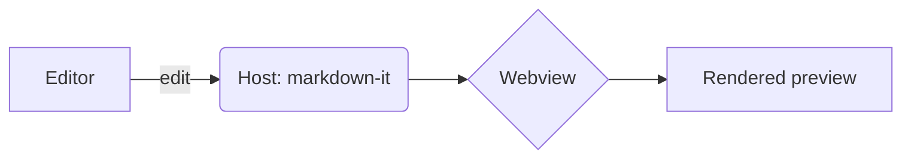
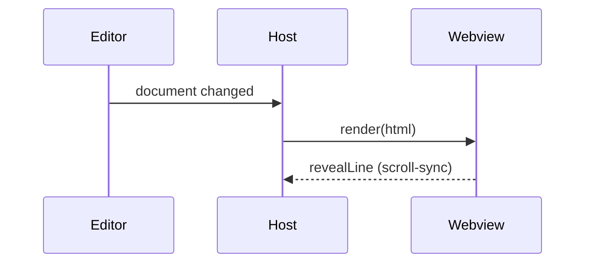

# Aurora Preview — Feature Showcase

This document exercises **every** feature Aurora Preview can render. Open it with
**Aurora: Open Preview to the Side** (`⌘K ⇧V`) and try the themes, scroll-sync,
image lightbox, and code copy button.

> Tip — switch `auroraPreview.theme` between **auto**, **terminal-glass**, and
> **sepia**, and set an `auroraPreview.accent` color to recolor everything.

---

## 1. Headings

# Heading 1
## Heading 2
### Heading 3
#### Heading 4
##### Heading 5
###### Heading 6

## 2. Text formatting

Regular text with **bold**, *italic*, ***bold italic***, ~~strikethrough~~,
`inline code`, and a [link to the repo](https://github.com). Autolinked URL:
https://code.visualstudio.com. Here is a footnote reference.[^1]

Typographer niceties: "curly quotes", en–dash, em—dash, and ellipsis…

[^1]: This is the footnote text, rendered at the bottom of the document.

## 3. Blockquotes & callouts

> A single-level blockquote.
>
> > A nested blockquote inside it.

GitHub-style alert callouts:

> [!NOTE]
> Useful information users should know, even when skimming.

> [!TIP]
> Helpful advice for doing things better or more easily.

> [!IMPORTANT]
> Key information users need to know to achieve their goal.

> [!WARNING]
> Urgent info that needs immediate attention to avoid problems.

> [!CAUTION]
> Advises about risks or negative outcomes of certain actions.

## 4. Lists

**Unordered (nested):**

- First item
  - Nested item
    - Deeper item
- Second item

**Ordered:**

1. Step one
2. Step two
   1. Sub-step
3. Step three

**Task list:**

- [x] Live preview with scroll-sync
- [x] Syntax highlighting
- [ ] PDF & HTML export
- [ ] More themes

## 5. Tables (with alignment)

| Feature        | Status | Notes                          |
| :------------- | :----: | -----------------------------: |
| Live preview   |   ✅   |               debounced ~120ms |
| Math (KaTeX)   |   ✅   |             inline + block     |
| Mermaid        |   ✅   |             theme-aware        |
| Export         |   ⏳   |               coming in v0.2   |

## 6. Code & syntax highlighting

Inline `const x = 42;` and fenced blocks in several languages:

```ts
export function activate(context: vscode.ExtensionContext) {
  const panel = PreviewPanel.createOrShow(context, editor); // live + debounced
  return panel;
}
```

```python
def fib(n: int) -> int:
    a, b = 0, 1
    for _ in range(n):
        a, b = b, a + b
    return a
```

```bash
code --install-extension aurora-preview
```

```json
{ "auroraPreview.theme": "auto", "auroraPreview.accent": "#4cd7b0" }
```

Hover a code block to reveal the language badge and the **copy** button.

## 7. Math (KaTeX)

Inline math like $E = mc^2$ and $\sum_{i=1}^{n} i = \frac{n(n+1)}{2}$ flows with text.

Block math:

$$
\int_{-\infty}^{\infty} e^{-x^2}\,dx = \sqrt{\pi}
\qquad
f(x) = \frac{1}{\sigma\sqrt{2\pi}}\, e^{-\frac{(x-\mu)^2}{2\sigma^2}}
$$

## 8. Diagrams (Mermaid)





## 9. Images (click to open full-screen)


## 10. Horizontal rule

---

That's the full feature set Aurora Preview renders today.
